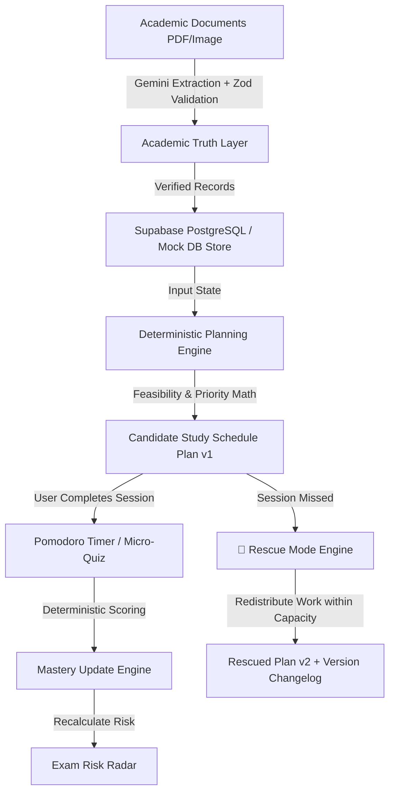

# StudyAI — Adaptive Academic Planner: Complete Project Documentation

## Executive Summary
**StudyAI — Adaptive Academic Planner** is built around one core principle:
> **"A study plan should not break just because the student's day did."**

The system replaces generic AI chatbots and static timetable generators with an adaptive, student-facing academic engine that automates setup via document import, calculates schedule feasibility, measures learning evidence through micro-quizzes, identifies exam risk, and repairs the plan when reality changes (Rescue Mode).

---

## 1. System Architecture & Tech Stack

- **Frontend Framework**: Next.js 16+ (App Router) with TypeScript & React 19
- **Styling**: Tailwind CSS v4, Lucide Icons, Recharts, Glassmorphism UI
- **Database**: Supabase PostgreSQL + Auth + Storage with RLS Policies & Local Mock Store fallback
- **AI Integration**: `@google/genai` (Gemini 2.5/3.0 Flash) with server-only routes & Zod validation
- **Date Math**: `date-fns`
- **Validation**: Zod
- **Testing**: Vitest + Custom Planner Engine Suite

---

## 2. Four Product Pillars

### Pillar A: ⚡ Energy-Based Scheduling
- **Task Classification**:
  - `HIGH ENERGY`: Difficult coding, mathematics, mock tests (`HIGH` difficulty topics).
  - `MEDIUM ENERGY`: Concept learning, assignments, practice (`MEDIUM` difficulty topics).
  - `LOW ENERGY`: Recall, revision, micro-quizzes (`LOW` difficulty topics).
- **Time Block Preferences**: Matches task energy requirements with user preferred periods (`MORNING` 06-12, `AFTERNOON` 12-17, `EVENING` 17-22, `NIGHT` 22-06).

### Pillar B: 📡 Exam Risk Radar
- **Deterministic Risk Scoring (`calculateExamRisk`)**:
  $$ \text{Risk Score} = 0.45 \times \text{ExamUrgency} + 0.25 \times \text{MasteryGap} + 0.20 \times \text{RemainingSyllabus} + 0.10 \times \text{Difficulty} $$
- **Thresholds**:
  - `0 – 35`: LOW RISK
  - `36 – 65`: MEDIUM RISK
  - `66 – 100`: HIGH RISK
- **Transparent Bullet Reasons**: Displays exact reasons (days remaining, low mastery count, syllabus coverage). Gemini provides optional conversational narrative explanations *after* score calculation.

### Pillar C: 🧪 AI Micro-Quizzes
- **2-Minute Mastery Check**: Triggered after study session completion.
- **Generation**: Gemini generates 3-5 standard MCQs / concept questions matching topic difficulty.
- **Deterministic Backend Scoring**: Backend calculates `scorePercentage` = (correct / total * 100). Never trusts LLM for scoring.
- **Mastery Engine Update**:
  $$ \text{New Mastery} = Math.round(0.40 \times \text{PrevMastery} + 0.60 \times \text{QuizScore}) $$
  Updates topic estimated mastery ($0 - 100\%$) and status (`UNKNOWN`, `LOW`, `MEDIUM`, `HIGH`).

### Pillar D: 🚨 Rescue Mode (Hero Feature)
- **Trigger**: Session missed or academic schedule change.
- **Engine Process**:
  1. Identifies missed work.
  2. Calculates remaining workload for all topics.
  3. Retrieves upcoming exam dates & daily study capacity caps.
  4. Recalculates topic priorities.
  5. Redistributes missed work across remaining days without exceeding daily capacity caps (e.g. 4h max) or creating overlaps.
  6. Protects high-priority exam prep while deferring low-priority revision if capacity is constrained.
  7. Bumps plan version (`Plan v1` $\rightarrow$ `Plan v2`) and logs exact change diffs (`MOVED`, `SPLIT`, `DEFERRED`, `PROTECTED`, `REMOVED`).

---

## 3. Core Deterministic Engines Summary

| Engine Module | File Path | Functionality |
|---|---|---|
| **Priority Engine** | `src/lib/planner/priority.ts` | $0.40 \text{Urgency} + 0.30 \text{Syllabus} + 0.20 \text{MasteryGap} + 0.10 \text{Difficulty}$ |
| **Capacity Engine** | `src/lib/planner/capacity.ts` | Daily study capacity window & maximum daily cap calculation |
| **Conflicts Engine** | `src/lib/planner/conflicts.ts` | Hard constraint validator (no overlaps, no post-exam study, capacity caps) |
| **Feasibility Engine** | `src/lib/planner/feasibility.ts` | Compares Workload vs Capacity; outputs `GREEN`, `YELLOW`, or `RED` with deficit mins |
| **Energy Engine** | `src/lib/planner/energy.ts` | Task requirement vs time block energy slot matching |
| **Candidate Planner** | `src/lib/planner/planner.ts` | Main deterministic candidate schedule generator |
| **Risk Radar Engine** | `src/lib/planner/risk.ts` | Exam risk scoring & factor breakdown |
| **Mastery Engine** | `src/lib/planner/mastery.ts` | Deterministic topic mastery updating |
| **Rescue Engine** | `src/lib/planner/rescue.ts` | Hero feature missed work redistribution & `Plan v2` versioning |
| **Next Best Action** | `src/lib/planner/next-action.ts` | `getNextBestAction(user)` top recommendation logic |
| **Academic Change** | `src/lib/planner/academic-change.ts` | Exam schedule change detection & comparison |

---

## 4. API Routes Architecture

- `GET /api/today`: Next Best Action, today's schedule, plan feasibility, and risk summary.
- `GET /api/plan` & `POST /api/plan/generate`: Active plan timetable, version info, and candidate schedule generation.
- `GET /api/risk`: Transparent Exam Risk Radar scores across all subjects.
- `GET /api/subjects`: Subjects list with syllabus topics and verified exam source evidence.
- `GET /api/sessions`: List study sessions with filtering.
- `POST /api/sessions/[id]/complete`, `miss`, `skip`: Session status lifecycle mutations.
- `POST /api/quiz/[id]/submit`: Deterministic quiz scoring & mastery update.
- `POST /api/rescue`: Execute Rescue Mode schedule redistribution.
- `GET /api/plan/[id]/changes`: Retrieve transparent changelog diffs for a plan version.
- `POST /api/academic/extract`: AI document extraction with Zod schema validation.
- `POST /api/academic/compare`: Detect exam schedule changes between documents.
- `POST /api/seed`: Reset and seed demo store with DSA, Math, COA, and OOP data.

---

## 5. UI Views & User Flows

1. **Today Page (`/`)**: Central product dashboard displaying Next Best Action, Plan Health banner, Upcoming Exams, Risk Radar summary, and Today's Schedule.
2. **Study Plan Page (`/plan`)**: Versioned timetable selector (`Plan v1`, `Plan v2`), session status tags, Feasibility indicator, and Plan Changelog Diffs.
3. **Subjects Page (`/subjects`)**: Syllabus topics breakdown, difficulty tags, estimated mastery progress bars, and verified exam source metadata (document name, page number).
4. **Risk Radar Page (`/risk`)**: Subject risk cards, score breakdown bars (Urgency 45%, Mastery 25%, Syllabus 20%, Difficulty 10%), bullet reasons, and AI explanations.
5. **Academic Inbox (`/inbox`)**: Document dropzone for exam schedules and syllabi, extraction summaries, evidence source verification (`✓ Verified`).
6. **Contextual Views**:
   - **Study Session Timer (`/session`)**: Pomodoro phase breakdown (5m Recall, 15m Learn, 15m Practice, 5m WrapUp).
   - **Micro-Quiz (`/quiz`)**: 2-minute mastery check with instant scoring & mastery update display.
   - **Rescue Mode (`/rescue`)**: Hero workflow 🚨 **Rescue My Schedule** comparing original vs rescued plan.
   - **Settings (`/settings`)**: Daily study capacity slider and energy level preference matrix.

---

## 6. Testing & Build Verification

- **Vitest Unit Test Suite (`tests/planner.test.ts`)**: PASS (7/7 tests passed).
- **Mandatory Critical Rescue Test (`tests/critical-rescue.test.ts`)**: PASS.
  - Test Scenario: Capacity Mon 3h, Tue 2h, Wed 3h, Thu 2h. Mon DSA 2h marked `MISSED`.
  - Assertions: No daily limit violation, no overlaps, DSA redistributed, higher priority work protected, version bumped to `Plan v2`, changes logged.
- **Linter (`npm run lint`)**: PASS (0 errors).
- **Production Build (`npm run build`)**: PASS (22 static & dynamic routes compiled cleanly).
